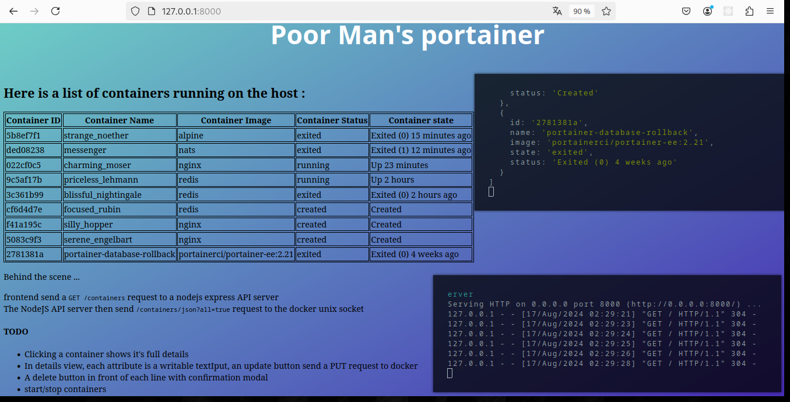
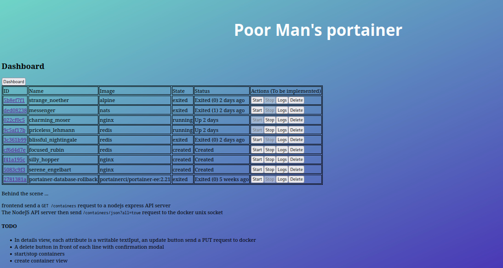
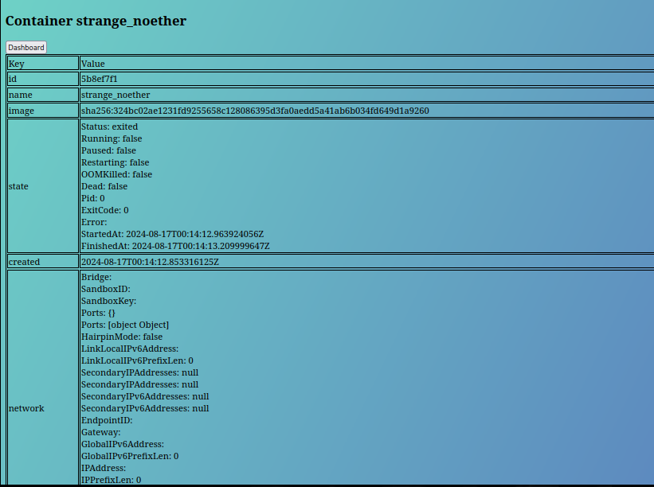

# Poor Man's Portainer

As an exercise to learn javascript, i decided to take portainer as an example and
imitate its most basic features :

- listing containers
- getting a specific container's details
- being able to start / stop / update / delete a container

# Frontend

Frontend is a basic html page with a small javascript companion.
The javascript send requests to the backend ( nodejs / Express API server, see below )
and update the container's table accordingly.

That's it.

¯\\\_(ツ)\_/¯

Just start `python3 -m http.server` in the frontend directory and go see the magic happenning at http://127.0.0.1:8000

# Backend

The backend is based on nodeJS and Express to act as an API server the frontend can speak to.
When it receive a request, it communicates directly with the docker unix socket, parses the
answer then return a curated version to the frontend

# Screenshots

### First version was :

### Current state :

